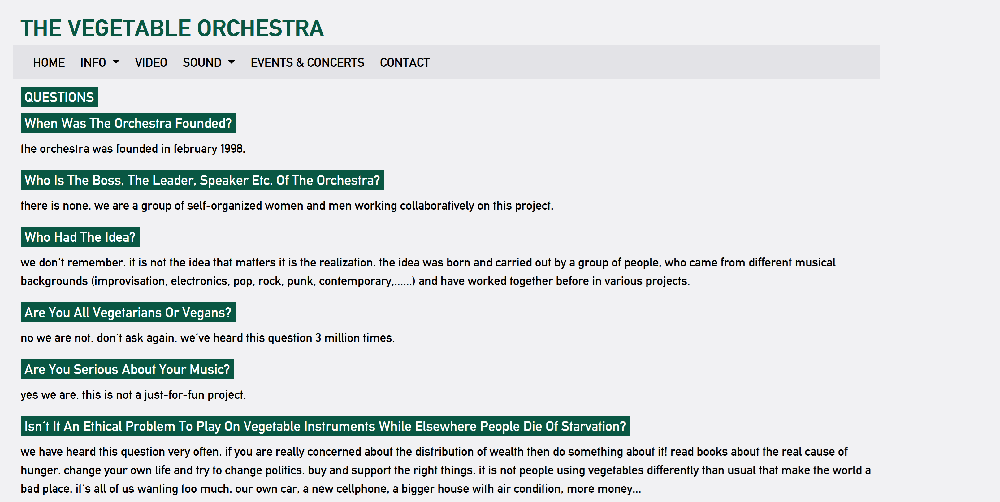

# The vegetable orchestra
In Vienna, Austria, there is an orchestra famous for making their instruments out of vegetables.  

Let's test whether the Wikipedia page about the vegetable orchestra can answer questions people frequently ask about the orchestra.

Quick links:
- [Demo video](#demo-video)
- [Wikipedia article](#wikipedia-article-about-the-vegetable-orchestra)
- [Questions](#questions-about-the-vegetable-orchestra)
- [Testing the content](#testing-the-wikipedia-article)
  

&nbsp;

## Demo video
This video demonstrates the process of testing to see if the Wikipedia page can answer those questions:

&nbsp;

## Wikipedia article about the vegetable orchestra
There is a very nice Wikipedia article about the vegetable orchestra:

https://en.wikipedia.org/wiki/The_Vegetable_Orchestra

&nbsp;

## Questions about the vegetable orchestra
But does this Wikipedia article answer questions that real people frequently ask about the vegetable orchestra?

To find out, first we need to collect some questions that real people have asked about the vegetable orchestra before.

### Source 1: FAQ by the vegetable orchestra members

One good source of questions real people ask about the vegetable orchestra is collected in a nice FAQ, created by the orchestra members themselves:

https://www.vegetableorchestra.org/qa.php

### Source 2: Questions collected by Google

Another source of questions asked by real people is Google search.

When many people submit similar questions in Google search queries, Google shows those common questions:

&nbsp;

## Testing the Wikipedia article
We can test whether the Wikipedia article answers those real questions:

1. Go to this demo tool: (url will be made available during the workshop)
2. Paste these questions into the tool: [Questions from real people]("./vegetable-orchestra-questions.txt")
3. Paste the Wikipedia article text into the tool: [Wikipedia article text]("./vegetable-orchestra_Wikipedia-article-org.txt")
4. Click **Test content** to test the content

### Optional: Improve results
If you want to see what a difference some content edits can make, try adding information to the article to answer mismatched questions and then clicking **Test content** again.

For example, here's a version of the article with information about making vegetable instruments added: [updated article]("./vegetable-orchestra_Wikipedia-article-new.txt")

&nbsp;

